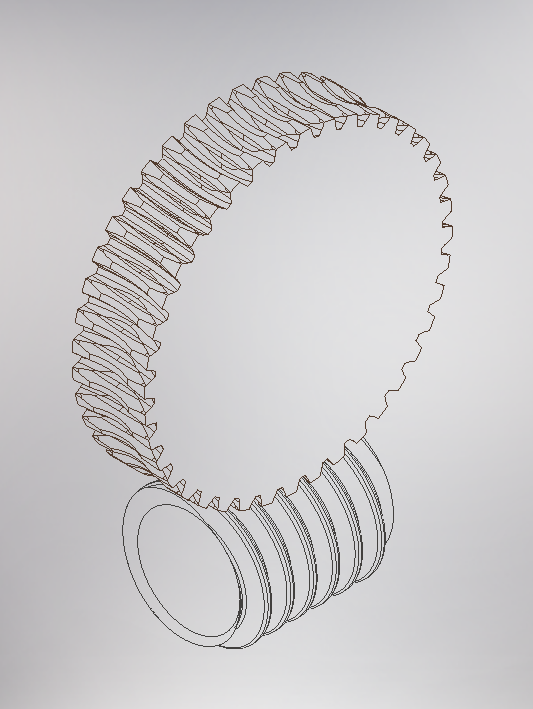

# Parametric Worm Gear
Parametric worm gear in CAD which makes it easy get accurate models for 3D printing or mahcining. This model is defined based on:
## In the worm parameter list
* Module 
* Number of starts
* Face width
* Pitch diamater
## In the wheel parameter list
* Number of teeth
* Profile coefficient shift
* Face Width

Tooth geometry is created to simulate a hob cut.

# Don't have Autodesk?
Ask the community or myself for a specific configuration and someone will produce a .stp for you.
